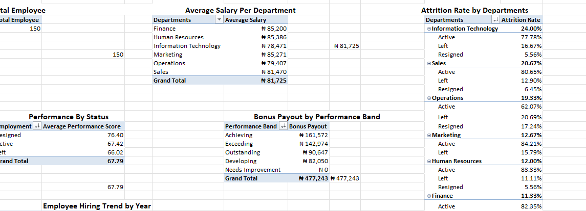
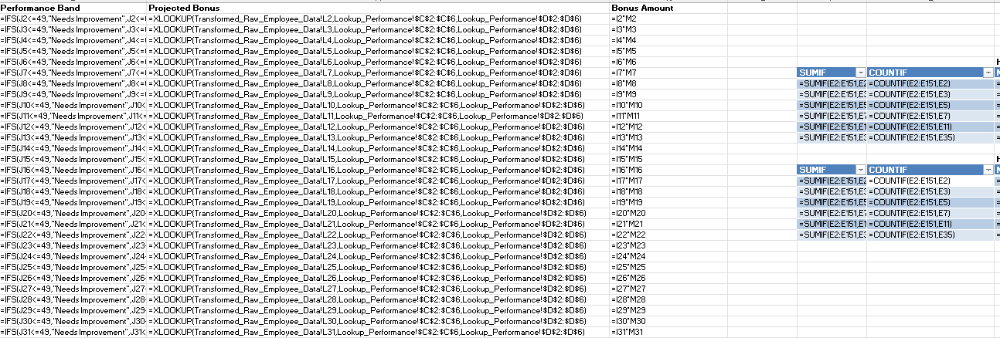
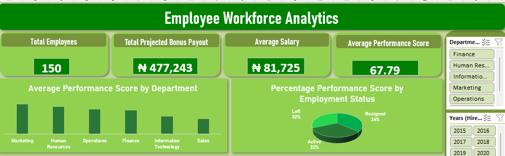

# HR Employee Data Cleaning & Analysis

## Project Objective

The objective of this project was to clean, transform, and prepare an HR employee dataset using Microsoft Excel. The cleaned dataset was then used to perform exploratory analysis, answer key business questions using Pivot Tables, and develop an HR analytics dashboard that provides insights into workforce composition, employee performance, compensation, attrition, and hiring trends.

---

## Tools & Techniques Used

### Software

* Microsoft Excel

### Excel Features

* Pivot Tables
* Pivot Charts
* Find & Replace
* Text to Columns
* Cell Formatting

### Excel Functions

* XLOOKUP
* TEXTJOIN
* YEARFRAC
* INT
* IFS
* SUMIF
* COUNTIF
* VALUE
* TRIM
* TODAY

### Data Cleaning Techniques

* Duplicate removal
* Missing value imputation using departmental averages
* Data type conversion
* Text standardization
* Date standardization
* Lookup table integration
* Feature engineering (creation of calculated columns)

---

## Overview

The dataset was assessed for data quality issues, cleaned, standardized, and enriched with additional calculated fields to improve consistency, accuracy, and analytical value. The cleaned dataset served as the foundation for subsequent analysis and dashboard development.

---

## Initial Data Exploration

The dataset was initially explored to assess its quality and identify issues that could affect the accuracy of the analysis. The following problems were observed:

* Duplicate records.
* Missing values in key fields such as Salary and Performance Score.
* Inconsistent data types across multiple columns.
* Inconsistent text formatting and spelling within categorical fields.
* Hire Date values stored as text instead of valid date formats.
* Missing department names, with only department codes available.

These issues were addressed before any analysis was performed to ensure the dataset was complete, consistent, and reliable.

---

# Data Cleaning Process

## 1. Removed Duplicate Records

Duplicate records were identified and removed to ensure that each employee appeared only once in the dataset.

---

## 2. Corrected Data Types and Formatting

The appropriate data type was assigned to each column:

* First Name, Last Name, and Employment Status were formatted as **Text**.
* Salary was formatted as **Currency**.
* Hire Date was formatted as a **Short Date (Day/Month/Year)**.

During formatting, some Hire Date values remained left-aligned, indicating that Excel had stored them as text rather than dates. The **Text to Columns** feature was used to convert these values into valid dates before applying the desired date format.

---

## 3. Standardized Text Values

### Department Code

* Removed leading and trailing spaces using the **TRIM** function.
* Standardized inconsistent department codes using **Find and Replace**.

### Employment Status

* Removed unnecessary spaces using **TRIM**.
* Corrected inconsistent spellings and naming conventions using **Find and Replace**, resulting in three standardized values:

  * Active
  * Left
  * Resigned

---

## 4. Handled Missing Values

Instead of replacing missing values with the overall dataset average, departmental averages were used to preserve the characteristics of each department.

### Salary

* Created a helper table using **SUMIF** and **COUNTIF** to calculate the average salary for each department.
* Replaced missing salary values with the corresponding departmental average.
* Used **VALUE(TRIM())** to remove hidden spaces and convert salary values into numeric format.

### Performance Score

* Created a helper table using **SUMIF** and **COUNTIF** to calculate the average performance score for each department.
* Replaced missing performance scores with the corresponding departmental average.

---

## 5. Created Additional Columns

Several new columns were created to support analysis and dashboard development.

### Full Name

The **TEXTJOIN** function was used to combine the First Name and Last Name columns into a single Full Name column. TEXTJOIN was selected instead of CONCAT to avoid unwanted leading or trailing spaces when either field was blank.

### Department Name

The **XLOOKUP** function was used to retrieve department names from the department lookup table based on each employee's department code.

### Years of Service

The **YEARFRAC** function was used to calculate the number of years between each employee's Hire Date and the current date. The **INT** function was then used to return completed years of service as whole numbers.

### Performance Band

The **IFS** function was used to categorize employees into performance bands based on their performance scores.

### Projected Bonus

A lookup table containing the bonus percentage for each performance band was referenced using **XLOOKUP**. The projected bonus for each employee was then calculated by multiplying the employee's salary by the corresponding bonus percentage.

---

# Analysis

Pivot Tables were created on a separate **Analysis** worksheet to answer the following business questions:

* Total headcount and average salary by department.
* Attrition rate by department.
* Average performance score by employment status.
* Total projected bonus payout by performance band.

The attrition rate was calculated by displaying employee counts as the **Percentage of Parent Row Total**, enabling the proportion of employees who had left each department to be determined.

---

## Pivot Table Analysis

**Pivot Table Analysis**

> ****

* Pivot Tables summarizing workforce headcount, average salary, attrition rate, average performance score, and projected bonus payout across departments and performance bands.

---

## Formula Reference Table

**Formula Reference Analysis**

> ****

* Screenshot of the key Excel formulas used throughout the project, including lookup, text manipulation, and calculation functions applied during data cleaning and feature engineering.
---

## Assumptions and Transformations

The following assumptions and transformations were applied during the cleaning process:

* Missing Salary and Performance Score values were replaced using departmental averages rather than the overall dataset average, assuming employees within the same department exhibit similar salary structures and performance characteristics.
* TEXTJOIN was used instead of CONCAT to generate cleaner Full Name values when either the first or last name was missing.
* Years of service were reported as completed whole years rather than fractional years.

---

## Challenges Encountered

Several Hire Date values were stored as text and could not be formatted using standard date formatting. This issue was identified by the left alignment of the affected cells and resolved using the **Text to Columns** feature to convert them into valid date values.

Another challenge involved converting salary values into usable numeric values after removing unwanted spaces. This was resolved using the **VALUE(TRIM())** function, which simultaneously cleaned and converted the values into numbers suitable for analysis.

Following the completion of these steps, the dataset was consistent, complete, and ready for analysis and dashboard development.

---

# Key Insights

* The **Marketing Department** recorded the highest average performance score among all departments, indicating consistently strong employee performance.
* The **Information Technology (IT) Department** experienced the highest attrition rate, suggesting that a greater proportion of employees left this department compared to others.
* Employees with a **Resigned** employment status recorded a higher average performance score than employees who remained **Active**, indicating that some high-performing employees left the organization.
* Employees within the **Achieving** performance band accounted for the highest projected bonus payout, reflecting the concentration of employees and bonus allocation within this category.
* Employee hiring reached its peak in **2017** before declining in subsequent years, while **2013** recorded the lowest number of hires during the period under review.

---

## HR Analytics Dashboard

**HR Analytics Dashboard**

> ****

* HR Analytics Dashboard summarizing workforce KPIs, hiring trends, performance metrics, compensation, and projected bonus distribution.

---

# Recommendations

Based on the findings from the analysis, the following recommendations are proposed:

* Investigate the factors contributing to the high attrition rate within the Information Technology department and implement targeted retention strategies.
* Conduct exit interviews and employee engagement assessments to understand why high-performing employees are resigning, and develop initiatives to improve retention.
* Continue recognizing and rewarding employees within the **Achieving** performance band while ensuring that bonus allocation remains aligned with organizational objectives.
* Review workforce planning and recruitment strategies to understand the decline in hiring after 2017 and determine whether staffing levels align with current business needs.
* Sustain the strong performance observed within the Marketing Department by identifying best practices that can be replicated across other departments.
